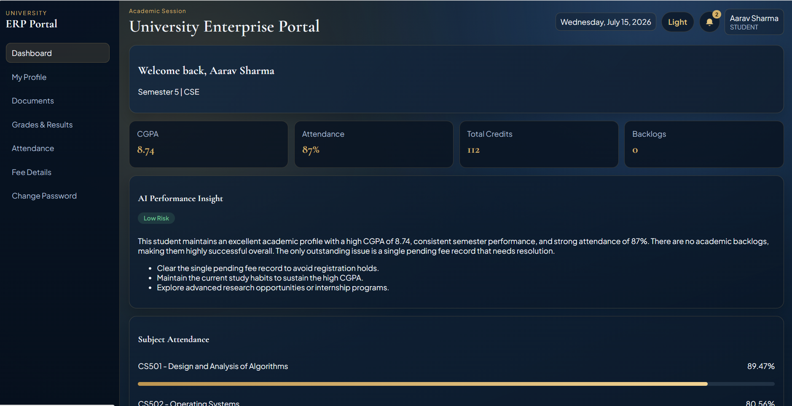
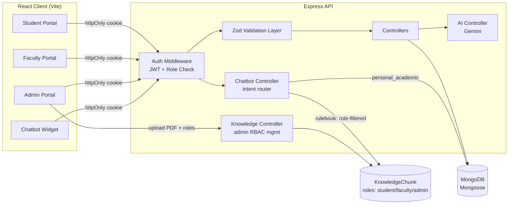

# AI-Powered University ERP System (MERN)

A full-stack university ERP portal with role-based modules for Student, Faculty, and Admin, integrated with a **hybrid Gemini-powered AI assistant** — rulebook Q&A (RAG), live personal academic data, and general chat, all in one widget. Access to rulebook content is enforced with **database-level, admin-managed RBAC** (not filename conventions), reassignable at runtime with zero re-uploads. Built on the MERN stack with JWT (httpOnly cookie) authentication, Zod validation, and rate-limited auth/AI routes.

[](https://github.com/manjeet26164/Student-Management-System-/actions/workflows/test.yml)

---

## Screenshots


*Role-based sign-in — Student / Faculty / Admin tabs*


*Student portal dashboard*

---

## Architecture



---

## Tech Stack

| Layer | Technology |
|---|---|
| Frontend | React 18, React Router 6, Axios, Vite 7 |
| Backend | Node.js, Express 4, JWT (httpOnly cookies), bcrypt |
| Database | MongoDB, Mongoose |
| Validation | Zod (all admin/faculty/auth routes) |
| Security | Helmet, express-rate-limit, CORS, regex-safe AI queries |
| Testing | Jest + Supertest + mongodb-memory-server |
| CI | GitHub Actions (server tests + client build) |

---

## Project Structure

```
client/
  src/
    components/
    context/
    layouts/
    pages/
    services/
    styles/
server/
  src/
    config/
    controllers/
    middleware/
    models/
    routes/
    seed/
    utils/
    validators/
  tests/
```

---

## Setup

### 1. Server

```bash
cd server
npm install
cp .env.example .env
```

`server/.env`:

```
PORT=5000
MONGO_URI=mongodb://127.0.0.1:27017/university_erp
JWT_SECRET=your_super_secret_jwt_key
JWT_EXPIRES_IN=7d
CLIENT_URL=http://localhost:5173
GEMINI_API_KEY=your_gemini_api_key
```

### 2. Client

```bash
cd client
npm install
cp .env.example .env
```

`client/.env`:

```
VITE_API_URL=http://localhost:5000/api
```

### 3. Seed demo data

```bash
cd server
npm run seed
```

> ⚠️ The seed script creates the **first admin account** (bootstrap). Before running this against a real/production database, edit `server/src/seed/index.js` and replace the credentials below with your own strong password.

| Role | Login ID | Password |
|---|---|---|
| Student | `STU23001` | `Student@123` |
| Faculty | `FAC2101` | `Faculty@123` |
| Admin | `ADM1001` | `Admin@123` |

New students/faculty are **not self-registered** — an admin creates their accounts from the Admin panel (`POST /admin/students`, `POST /admin/faculties`). This matches how real university ERPs work: accounts are provisioned by the institution, not signed up publicly.

The demo-credentials hint on the login page only shows in local development (`npm run dev`). It's automatically hidden in the production build (`npm run build`) and replaced with a "contact your administration" note.

### 4. Run

```bash
# terminal 1
cd server && npm run dev

# terminal 2
cd client && npm run dev
```

Open `http://localhost:5173`

---

## AI Assistant

A floating chatbot widget (bottom-right, all portals) handles three intents via **local regex classification** — no extra Gemini call spent on routing:

| Intent | Trigger | Source of truth |
|---|---|---|
| `rulebook` | rules, fees, fines, deadlines, policies | RAG over `KnowledgeChunk` collection, filtered by role |
| `personal_academic` | "my CGPA", "my attendance", "my fee status" | Live MongoDB read (`Result`, `Attendance`, `Fee`, `Student`) — student role only |
| `general` | greetings, small talk | Answered directly, no restricted context |

Replies match the user's language style — plain English in, English out; Hindi/Hinglish in, Hinglish out.

### Role-based access control — database-level, not filename-based

Rulebook documents are access-controlled by a `roles: ["student" | "faculty" | "admin"]` field stored **per chunk in MongoDB** — never inferred from the PDF's filename. This is managed from **Admin → Knowledge Base**:

- Upload a rulebook PDF and pick which roles can see it via checkboxes at upload time
- **Reassign roles on an existing document at any time — no re-upload, no rename.** The change takes effect on the very next query.
- A file's name carries no access meaning; renaming or duplicating a PDF cannot grant or leak access.

This closes a common gap in student-management clones, where "student_*.pdf" naming conventions are the *only* access control and break the moment a file is renamed or misnamed.

---

## Testing

```bash
cd server
npm test
```

Runs Jest + Supertest against an in-memory MongoDB instance (`mongodb-memory-server`) — no real database or secrets needed. Gemini/AI calls are mocked in tests.

Test suites: `auth`, `auth.ratelimit`, `student.routes`, `admin.students`, `ai`, `chatbot`.

The `chatbot` suite specifically verifies: intent routing, that rulebook retrieval is filtered by the DB `roles` field (using deliberately misleading filenames to prove filename has no bearing on access), that a role reassignment takes effect immediately without any re-upload, personal-data scoping to the logged-in student only, and graceful handling of Gemini 429 rate-limit errors.

---

## API Reference

Base URL: `/api` · All protected routes require an httpOnly JWT cookie set by `/auth/login`.

<details>
<summary><b>📖 Full API Reference (click to expand)</b></summary>

### Auth (`/api/auth`) — public / self

| Method | Endpoint | Auth | Description |
|---|---|---|---|
| POST | `/login` | Public (rate-limited, 5/15min) | Login by role, sets httpOnly JWT cookie |
| POST | `/logout` | Protected | Clears auth cookie |
| GET | `/me` | Protected | Returns current logged-in user |
| PUT | `/change-password` | Protected | Change own password |

### Student (`/api/student`) — role: `student`

| Method | Endpoint | Description |
|---|---|---|
| GET | `/dashboard` | Student dashboard summary |
| GET | `/profile` | Own profile details |
| GET | `/results` | Exam results |
| GET | `/attendance` | Attendance records |
| GET | `/fees` | Fee status |
| GET | `/notifications` | Notifications |
| GET | `/documents` | List uploaded documents |
| POST | `/documents/upload` | Upload a document (multipart) |
| GET | `/ai/insights` | AI-generated insights (20 req/hour) |

### Faculty (`/api/faculty`) — role: `faculty`

| Method | Endpoint | Description |
|---|---|---|
| GET | `/classes` | Assigned classes |
| GET | `/students` | Students in assigned classes |
| POST | `/attendance` | Mark attendance (Zod-validated) |
| POST | `/marks` | Upload marks (Zod-validated) |
| GET | `/records` | Class records |
| GET | `/notifications` | Notifications |
| GET | `/documents` | Documents pending verification |
| PUT | `/documents/:documentId/verify` | Verify a student document |
| GET | `/ai/insights` | AI class insights (15 req/hour) |

### Chatbot (`/api/chatbot`) — role: `student` | `faculty` | `admin`

| Method | Endpoint | Auth | Description |
|---|---|---|---|
| POST | `/query` | Protected (15 req/min) | Ask the AI assistant; response includes `{ answer, sources, intent }` |

### Admin (`/api/admin`) — role: `admin`

| Method | Endpoint | Description |
|---|---|---|
| GET | `/students` | List students (paginated) |
| POST | `/students` | Add student (Zod-validated) |
| PUT | `/students/:id` | Update student (Zod-validated, strict schema) |
| DELETE | `/students/:id` | Delete student |
| GET | `/faculties` | List faculty |
| POST | `/faculties` | Add faculty (Zod-validated) |
| PUT | `/faculties/:id` | Update faculty (Zod-validated) |
| DELETE | `/faculties/:id` | Delete faculty |
| GET | `/subjects` | List subjects |
| POST | `/subjects` | Add subject (Zod-validated) |
| PUT | `/subjects/:id` | Update subject (Zod-validated, strict schema) |
| DELETE | `/subjects/:id` | Delete subject |
| POST | `/marks` | Upload marks (shared schema with faculty) |
| POST | `/attendance` | Update attendance (shared schema with faculty) |
| POST | `/fees` | Update fee status |
| POST | `/ai/query` | AI query over student data (10 req/hour) |
| GET | `/knowledge` | List rulebook documents with chunk count + assigned roles |
| POST | `/knowledge` | Upload a rulebook PDF (multipart, field `file`) with explicit `roles[]` |
| PUT | `/knowledge/:sourceFile` | Reassign roles for an existing document — no re-upload needed |
| DELETE | `/knowledge/:sourceFile` | Remove a rulebook document and all its chunks |

</details>

---

## Security Notes

- **JWT in httpOnly cookies** — not localStorage, to reduce XSS exposure.
- **Consistent 401 on login failure** — wrong password and unknown user both return `401 Invalid credentials`, preventing account/role enumeration.
- **Regex-safe AI queries** — user/AI-extracted values (e.g. branch, section) are escaped before being used in MongoDB regex filters, preventing regex-injection.
- **Zod validation everywhere** — every admin/faculty/auth mutating route is schema-validated; `updateStudent`/`updateSubject` use `.strict()` schemas to reject unknown fields (blocks mass-assignment).
- **Rate limiting** — login (5/15 min) and all AI endpoints are rate-limited per role.
- **Shared validators** — `uploadMarksSchema` and `updateAttendanceSchema` are defined once and reused by both admin and faculty routes (DRY).
- **No public self-registration** — accounts are provisioned by the admin, not signed up by users, reducing fake-account risk.
- **Database-level document RBAC** — rulebook PDF access is controlled by a `roles` field stored per chunk in MongoDB, assigned explicitly by an admin at upload time and reassignable anytime. Filenames carry no access meaning, so renaming or misnaming a file cannot grant or leak access.

---

## CI/CD

GitHub Actions (`.github/workflows/test.yml`) runs on every push/PR:

- **server-tests** — Node 20, `npm ci`, `npm test` (Jest + Supertest, in-memory Mongo, no secrets required)
- **client-build** — Node 20, `npm ci`, `npm run build` (Vite)

---